# 🎬 Full-Stack Movie Application

A **complete full-stack microservices application** with authentication, JWT-based security, and persistent data storage — all containerized with Docker Compose.

Built using **Node.js**, **Go**, **PostgreSQL**, and a **vanilla HTML/JS frontend**.

---

## 🏗️ Architecture Overview

```mermaid
graph TD
    Browser[💻 Browser] -- HTTP Requests --> NodeBackend[🟢 Node.js User Service]
    NodeBackend -- Serves --> Frontend[🌐 HTML/JS Frontend]
    Frontend -- Register/Login --> NodeBackend
    Frontend -- Authenticated Requests (JWT) --> GoBackend[💛 Go Movie Service]
    NodeBackend -- DB Connection --> PostgreSQL[🗄 PostgreSQL Database]
    GoBackend -- DB Connection --> PostgreSQL
```



**Services:**

* **Frontend:** Lightweight HTML + JS (no frameworks) served by Node.js.
* **User Service (Node.js):** Handles registration/login, password hashing, JWT issuance.
* **Movie Service (Go):** Requires valid JWT, manages favorite movies.
* **PostgreSQL:** Shared database for both services.

---

## 🚀 Tech Stack

| Layer               | Technologies                                            |
| ------------------- | ------------------------------------------------------- |
| **Frontend**        | HTML5, CSS3, JavaScript (ES6+), Fetch API               |
| **Backend (User)**  | Node.js, Express.js, bcryptjs, jsonwebtoken, pg, dotenv |
| **Backend (Movie)** | Go, Gorilla Mux, JWT-Go, pq, cors                       |
| **Database**        | PostgreSQL                                              |
| **DevOps**          | Docker, Docker Compose                                  |

---

## ⚙️ Setup & Run

### 1️⃣ Clone the repository

```bash
git clone <repository_url>
cd <repository_directory>
```

### 2️⃣ Build & start with Docker Compose

```bash
docker-compose up --build
```

This will:

* Build Node.js & Go services
* Start PostgreSQL
* Run services on:

  * **Node.js:** `http://localhost:3100`
  * **Go:** `http://localhost:4100`

### 3️⃣ Open in browser

```
http://localhost:3100
```

---

## 🎯 Features

✅ **User Registration & Login** with password hashing (bcrypt)
✅ **JWT Authentication** for secure API requests
✅ **Add & View Favorite Movies** tied to the logged-in user
✅ **Persistent Storage** in PostgreSQL
✅ **Containerized Microservices** with Docker Compose

---

## 🖥 Usage Flow

1. **Register** → Create an account with email & password.
2. **Login** → Get a JWT token stored in `localStorage`.
3. **Add Movies** → Enter a movie name and add it to your list.
4. **View Movies** → See all your saved favorites instantly.
5. **Logout** → Clear session & token.

---

## 📂 Project Structure

```
📦 project-root
 ┣ 📂 frontend       # Static HTML/JS files
 ┣ 📂 user-service   # Node.js authentication service
 ┣ 📂 movie-service  # Go movie management service
 ┣ 📂 db             # Database initialization scripts
 ┣ 📜 docker-compose.yml
 ┗ 📜 README.md
```

---

## 🐳 Docker Compose Services

| Service           | Port | Description                 |
| ----------------- | ---- | --------------------------- |
| **user-service**  | 3100 | Node.js User API + frontend |
| **movie-service** | 4100 | Go Movie API                |
| **db**            | 5432 | PostgreSQL database         |

---

## 📸 Demo Preview

*(Optional: Add screenshots or a GIF here to showcase the app in action)*


---

💡 **Pro Tip:** This project is a great starting point for learning **microservices, JWT authentication, and container orchestration**.

---

